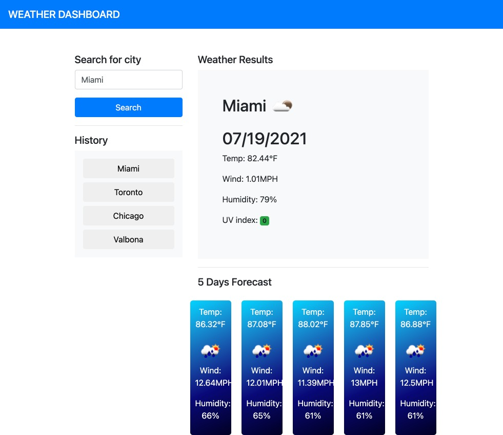

# homework06-weather-dashboard

# General Information
This assignment required me to use a an API to fetch current weather data for different cities. The app will display the current weather conditions in that city, including temperature, humidity, UV index, and a picture representing the weather pattern. It will also display a 5-day weather foredast. Once you look up a city, the city is added to history using local storage for easy access in the future. 

Below is a summary of what I implemented. 

* Added HTML and CSS to display weather
* Added JS code to read the search input from the user
* Added code to call an API once a user click the search button
* Cleaned the output from the API and used to to display the weather (temp, UV, icon, etc)
* Called a second API to get a 5-day forcast for the city
* Used a for loop to go the through the 5 days and render the information in the HTML

# Technologies
This project is created with:
* Bootstrap
* CSS
* HTML5
* JavaScript
* jQuery
* Moment.js
* Open Weather API

# Screenshot
 

## Link
This is the link to the following assignment: [link](https://valbona1992.github.io/homework06-weather-dashboard/)
